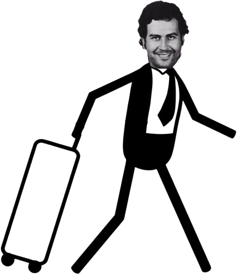

# **Le problème du voyageur de commerce**

Entre une solution exacte et une complexité polynomial

---

# Sommaire

- Présentation du problème
- Quelques mots sur le problème
- Algorithmes exactes
  - Recherche exhaustive
- Algorithmes polynomiales
  - Glouton de la distance restante
  - Glouton de la proximité
  - Random
  - Tri statique
- Données utilisées
- Résultats

---

# Présentation du problème



Voici Pablo
Pablo veut savoir qu’elle est le meilleur chemin afin de faire proliférer son commerce
de farine


---

# Quelques mots sur le problème

- C’est un problème qualifié de NP-Complet
- Il appartient au groupe des problèmes d’optimisation
- La difficulté est de trouver la meilleure solution en une complexité polynomiale
- Le principe est de trouver le plus court circuit à parcourir entre n points en partant d’un point donné

---

# Recherche exhaustive

Description : Essaye chaque possibilité et calcule la distance, si elle est inférieure à la + courte distance déjà connue alors il définit ce chemin comme étant le + court
Complexité : $O(n*n!)$

```c
void permute(int start) {
    if (start > NB_CITIES-2) copy_path_to_min_path();
    for (int i = start; i < NB_CITIES-1; i++) {
        swap_path(start, i);
        permute(start+1);
        swap_path(start, i);
    }
}
void brute_force() {
    init_path();
    permute(0);
}
```

---

# Glouton de la distance restante

Description : Choisit la ville qui est + proche des villes restantes
Complexité : $\sum_{i=1}^{n}\sum_{j=1}^{n}1 + \sum_{i=1}^{n}(1 +\sum_{j=i+1}^{n}2) \le 3n^{2} = O(n^{2})$

```c
void greedy_distance_remaining() {
    init_path();
    couple array[NB_CITIES-1];
    /* Calcul la distance la moyenne entre chaque villes*/
    
    for (int i=0; i<NB_CITIES-1; i++) {
        couple min = {i, __INT_MAX__};
        for (int j=i; j<NB_CITIES-1; j++) if (array[j].y < min.y) {
            min.x = j; min.y = array[j].y;
        }
        swap_path(i, min.x); swap_couple(i, min.x, array);
        for (int j=i+1; j<NB_CITIES-1; j++)
            array[j].y -= distance_cities[path[i]][array[j].x];
    }
}
```

---

# Glouton de la proximité

Description : Choisit la ville qui est + proche de celle actuelle
Complexité : $\sum_{i=1}^{n}\sum_{j=i}^{n}1 \le n^{2} = O(n^{2})$

```c
void greedy_proximity() {
    init_path();
    int actual_city = starting_city;
    for (int i=0; i<NB_CITIES-1; i++) {
        couple min = {i, __INT_MAX__};
        for (int j=i; j<NB_CITIES-1; j++)
            if (distance_cities[actual_city][path[j]] < min.y) {
                min.x = j;
                min.y = distance_cities[actual_city][path[j]];
        }
        swap_path(i, min.x);
        actual_city = path[i];
    }
    copy_path_to_min_path();
}
```

---

# Random

Description : Mélange la liste de ville et la renvoie, probabilités $\le \frac{n!}{2}$
Complexité : $O(n)$

```c
void shuffle() {
    init_path();
    srand(time(NULL));
    for (int i=0; i<NB_CITIES-1; i++)
        swap_path(rand() % (NB_CITIES-1), i);
    copy_path_to_min_path();
}
```

---

# Tri statique

Description :
	Renvoi les villes triées par leur distance à la ville de départ
Complexité : $O(n*log(n))$, le coût du tri 


```c
void static_sort() {
    init_path();
    couple array[NB_CITIES-1];
    for (int i=0; i<NB_CITIES-1; i++) {
        couple c = {path[i], distance_cities[starting_city][path[i]]};
        array[i] = c;
    }
    merge_sort(array, 0, NB_CITIES-2);
    for(int i=0; i<NB_CITIES-1; i++) path[i] = array[i].x;
    copy_path_to_min_path();
}
```

---

# Fonctions utiles

```c
void copy_path_to_min_path() {
    int dist =
        distance_cities[starting_city][path[0]]
        + distance_cities[path[NB_CITIES-2]][starting_city];
    for (int i=0; i<NB_CITIES-2; i++)
        dist += distance_cities[path[i]][path[i+1]];
    if (dist < min_path[0]) {
        min_path[0] = dist;
        for (int i=1; i<NB_CITIES; i++) min_path[i] = path[i-1];
    }
}
void init_path() {
    min_path[0] = __INT_MAX__;
    for (int i = 0; i < NB_CITIES-1; i++)
        path[i] = i + (i >= starting_city);
}
void swap_path(int i, int j) {
    int temp = path[i];
    path[i] = path[j];
    path[j] = temp;
}
```

---

# Données utilisées

| | Armenia | Bogota | Cartagena | Neiva | San Agustin |
| - | - | - | - | - | - |
| **Armenia** | 0 | 177 | 652 | 184 | 303 |
| **Bogota** | 177 | 0 | 663 | 230 | 388 |
| **Cartagena** | 652 | 663 | 0 | 831 | 953 |
| **Neiva** | 184 | 230 | 831 | 0 | 159 |
| **San Agustin** | 303 | 388 | 953 | 159 | 0 |

---

# Résultats

Il ne reste plus qu’à ce que Pablo choisisse la méthode qui lui convient le mieux


Recherche exhaustive : `Cartagena, Armenia, San Agustin, Neiva : 2007 km`
Glouton de la distance restante : `Armenia, Neiva, San Agustin, Cartagena : 2136 km`
Glouton de la proximité : `Armenia, Neiva, San Agustin, Cartagena : 2136 km`
Tri statique : `Armenia, Neiva, San Agustin, Cartagena : 2136 km`